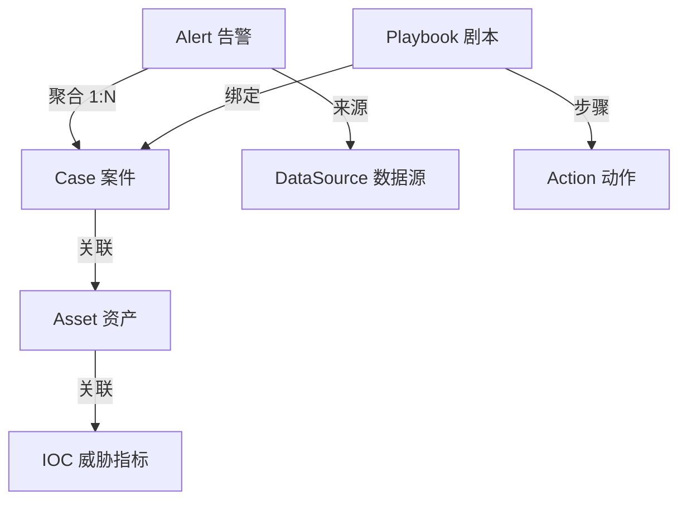
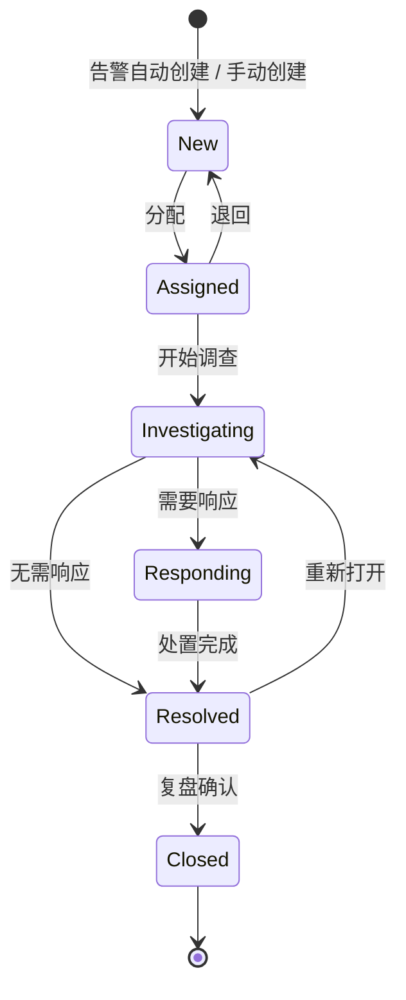
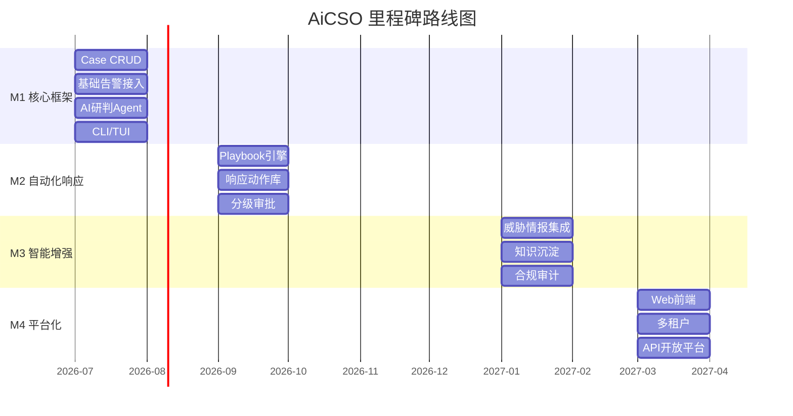

# AiCSO 产品需求文档 (PRD)

> 版本：v0.1 | 日期：2026-06-12 | 状态：Draft

---

## 1. 产品概述

### 1.1 产品背景

安全运营团队正面临四个结构性困境：

**告警疲劳**：中大型企业SOC每天面对数千至数万条告警，其中超过90%为误报或低价值告警。分析师陷入"告警海洋"，真正的威胁被淹没在噪声中。

**人才短缺**：安全分析师培养周期长（L1→L2通常需要2-3年），行业人才缺口持续扩大。有经验的分析师被大量重复性工作消耗，无法聚焦高价值任务。

**工具孤岛**：SOC通常使用10+安全工具（SIEM、EDR、NDR、WAF、TIP等），工具间缺乏有效联动，分析师需要在多个平台间手动切换，上下文丢失严重。

**响应迟缓**：从告警产生到完成处置，平均响应时间（MTTR）通常以天计。攻击者在分钟级别完成横向移动，防御者在天级别完成响应——时间窗口严重不对称。

与此同时，大语言模型（LLM）和AI Agent技术的成熟为安全运营带来了范式变革的可能。AI不仅能辅助分析，更能作为"数字安全分析师"自主完成研判、关联、响应等工作流。

**AiCSO 正是为此而生——一个以Case为中心、AI-Native的安全运营Agent框架。**

### 1.2 产品定义

**全称**：AiCSO — AI Cyber Security Operations

**一句话定义**：AiCSO是一个以Case为中心的AI-Native安全运营Agent框架，通过多Agent协作实现告警聚合、智能研判、自动化响应，将安全运营从"人工驱动"升级为"AI驱动+人工监督"。

**核心理念**：
- **Case为中心**：所有安全运营工作围绕Case展开，Case是事件调查、响应处置、知识沉淀的核心载体
- **AI-Native**：不是在传统SOC上叠加AI助手，而是用AI重构安全运营的每一个环节
- **Agent协作**：多个专业Agent各司其职，由编排Agent统一调度，模拟真实SOC团队的协作模式
- **开源开放**：完全开源，社区驱动，避免厂商锁定

### 1.3 目标用户

| 角色 | 核心诉求 | AiCSO如何帮助 |
|------|----------|---------------|
| **SOC L1分析师** | 快速分诊告警，区分真假阳性 | AI自动聚合告警、预判研判、过滤误报，L1只需确认AI判断 |
| **SOC L2分析师** | 深入调查事件，确定影响范围 | Agent自动关联资产、情报、历史案例，生成调查报告，提供响应建议 |
| **SOC L3分析师** | 高级威胁狩猎，APT分析 | Agent辅助攻击链还原、IoC扩展、威胁画像，支持假设驱动的深度调查 |
| **SOC管理者** | 团队效率、态势总览、合规报告 | 自动化运营报告、Case SLA监控、团队工作量分析 |

---

## 2. 核心概念模型

### 2.1 概念关系图



### 2.2 Case（案件）

Case是AiCSO的核心实体，代表一个安全事件的完整上下文容器。

**核心属性**：
| 属性 | 说明 | 示例 |
|------|------|------|
| case_id | 唯一标识 | CSO-2026-000001 |
| title | 案件标题 | "疑似钓鱼邮件攻击-财务部" |
| severity | 严重级别 | critical / high / medium / low / info |
| status | 当前状态 | 见状态机定义 |
| priority | 优先级 | P1-P5 |
| assignee | 负责人 | analyst@soc.com |
| tags | 标签 | ["phishing", "lateral-movement"] |
| alerts | 关联告警列表 | [alert-001, alert-002, ...] |
| assets | 关联资产列表 | [asset-001, ...] |
| iocs | 关联IoC列表 | ["1.2.3.4", "evil.com", ...] |
| timeline | 事件时间线 | [{time, action, actor, detail}] |
| ai_summary | AI生成的摘要 | "该案件涉及..." |
| ai_recommendation | AI处置建议 | "建议立即隔离主机..." |
| resolution | 处置结果 | "确认为误报/已处置/..." |
| created_at | 创建时间 | 2026-06-12T10:00:00Z |
| updated_at | 更新时间 | 2026-06-12T15:30:00Z |
| sla_deadline | SLA截止时间 | 2026-06-12T18:00:00Z |

**严重级别定义**：

| 级别 | 定义 | 判断依据 | 示例 |
|------|------|---------|------|
| critical | 确认的安全事件，已造成或即将造成重大业务影响 | 确认的数据泄露、勒索软件执行、核心系统被控 | 生产数据库被拖库、域控被接管 |
| high | 高度可疑的安全事件，需立即响应 | 多个高置信度告警关联、威胁情报命中、异常横向移动 | C2通信确认、可疑的特权账号操作 |
| medium | 可疑活动，需调查确认 | 单个高置信度告警或多个低置信度告警关联 | 异常登录行为、可疑外联 |
| low | 低风险告警，可能存在安全风险 | 单个低置信度告警、策略违规 | 弱密码告警、非标端口通信 |
| info | 信息性事件，仅记录不需要响应 | 合规检查结果、系统状态变更 | 策略变更通知、资产上线 |

**严重级别与优先级映射**：

| 严重级别 | 默认优先级 | SLA（响应/处置） | 可升级条件 |
|---------|-----------|-----------------|-----------|
| critical | P1 | 15min / 1h | — |
| high | P2 | 30min / 4h | 业务高峰期自动升级为P1 |
| medium | P3 | 2h / 24h | 涉及核心资产升级为P2 |
| low | P4 | 8h / 72h | 批量出现升级为P3 |
| info | P5 | 不限 | — |

**Case生命周期状态机**：



**状态说明**：
| 状态 | 说明 | 操作者 |
|------|------|--------|
| New | 新建，待分配 | 系统自动 / 手动 |
| Assigned | 已分配，待调查 | 管理者 / AI |
| Investigating | 调查中 | 分析师 / AI |
| Responding | 响应处置中 | 分析师 / AI / Playbook |
| Resolved | 已处置，待复盘 | 分析师 |
| Closed | 已关闭 | 管理者 / 分析师 |

### 2.3 Alert（告警）

告警是来自安全设备的原始检测信号，是Case的输入源。

**核心属性**：
| 属性 | 说明 |
|------|------|
| alert_id | 唯一标识 |
| source | 来源设备（如：Suricata、WAF、EDR） |
| rule_id | 触发规则ID |
| rule_name | 规则名称 |
| severity | 原始严重级别 |
| timestamp | 告警时间 |
| src_ip / dst_ip | 源/目标IP |
| src_port / dst_port | 源/目标端口 |
| protocol | 协议 |
| raw_log | 原始日志 |
| enriched_data | 富化后的上下文数据 |
| case_id | 所属Case（聚合后填充） |
| is_false_positive | 误报标记 |

**告警聚合策略**：
- **相同源IP聚合**：同一源IP在时间窗口内的告警归为一个Case
- **相同目标资产聚合**：针对同一资产的多条告警归为一个Case
- **攻击链聚合**：基于ATT&CK战术阶段关联的告警归为一个Case
- **自定义规则聚合**：用户可配置聚合规则
- **AI辅助聚合**：Agent基于上下文语义判断是否应合并

### 2.4 Playbook（剧本）

Playbook是标准化的安全响应流程模板。

**类型**：
- **自动执行**：低风险操作，Agent可直接执行（如：查询威胁情报、富化上下文）
- **人工审批**：高风险操作，需人工确认后执行（如：封禁公网IP、隔离生产主机）
- **混合执行**：流程中包含自动和人工步骤

**示例Playbook - 钓鱼邮件响应**：
```yaml
name: phishing_email_response
description: 钓鱼邮件事件标准响应流程
trigger:
  case_tags: ["phishing"]
steps:
  - name: 提取IoC
    action: extract_ioc_from_email
    auto: true
  - name: 威胁情报查询
    action: query_threat_intel
    auto: true
  - name: 检查邮件网关
    action: check_email_gateway
    auto: true
  - name: 召回恶意邮件
    action: recall_malicious_email
    approval_required: true
    risk_level: medium
  - name: 封禁发件人
    action: block_sender
    approval_required: true
    risk_level: low
  - name: 重置受影响账号密码
    action: reset_password
    approval_required: true
    risk_level: high
  - name: 生成事件报告
    action: generate_report
    auto: true
```

### 2.5 Agent（智能体）

**核心编排Agent（Orchestrator）**：
- 接收告警流，触发Case创建
- 分析Case上下文，决定调用哪些子Agent
- 管理子Agent间的协作与信息传递
- 汇总子Agent结果，更新Case状态

**专业子Agent**：

| Agent | 职责 | 典型工具 |
|-------|------|----------|
| TriageAgent（分诊Agent） | 告警分类、聚合、初步研判 | 告警查询、规则匹配、历史Case检索 |
| InvestigationAgent（调查Agent） | 深入调查、攻击链还原 | 资产查询、日志检索、情报查询、关联分析 |
| ResponseAgent（响应Agent） | 执行响应动作 | IP封禁、主机隔离、账号管理、邮件召回 |
| IntelAgent（情报Agent） | 威胁情报查询与分析 | 情报源API、IoC匹配、ATT&CK映射 |
| ReportAgent（报告Agent） | 生成事件报告和摘要 | 模板引擎、Case数据聚合 |
| ComplianceAgent（合规Agent） | 合规检查与审计 | 策略引擎、合规标准库 |

### 2.6 事件分类体系

Case支持基于ATT&CK框架的事件类型标签，用于标准化分类和统计分析：

| 事件类型 | ATT&CK战术 | 典型告警来源 | 默认Playbook |
|---------|-----------|-------------|-------------|
| 钓鱼攻击 | Initial Access | 邮件网关、沙箱 | phishing-response |
| 暴力破解 | Credential Access | WAF、VPN、SSH日志 | brute-force-response |
| 恶意软件 | Execution, Persistence | EDR、沙箱 | malware-response |
| 横向移动 | Lateral Movement | NDR、EDR、AD日志 | lateral-movement-response |
| 数据外传 | Exfiltration | DLP、NDR、代理日志 | exfiltration-response |
| 权限提升 | Privilege Escalation | EDR、AD日志 | privesc-response |
| 拒绝服务 | Impact | NDR、WAF、CDN | dos-response |
| 挖矿行为 | Execution | EDR、HIDS | crypto-mining-response |
| 账号异常 | Credential Access, Initial Access | IAM、VPN、SSO | account-anomaly-response |

用户可自定义事件类型和对应的ATT&CK映射。

---

## 3. 功能规划

### Phase 1 — MVP（第1-4月）

> 核心目标：跑通"告警→Case→研判"的最小闭环

#### 3.1 Case生命周期管理

**P0 - 必须实现**：
- Case CRUD（创建、读取、更新、关闭）
- Case状态流转（New → Assigned → Investigating → Resolved → Closed）
- Case分配（手动分配 + AI推荐）
- Case详情（告警列表、基本信息、时间线）
- Case列表（筛选、排序、搜索）

**P1 - 重要**：
- Case关联管理（Case↔资产、Case↔IoC）
- Case评论/协作（分析师备注、AI建议）
- Case SLA管理（超时告警）
- Case模板（快速创建常见类型Case）

#### 3.2 告警接入与智能研判

**P0 - 必须实现**：
- 统一告警数据模型（适配主流安全设备告警格式）
- 至少2个数据源适配器（如：Syslog通用解析、API拉取）
- 告警聚合引擎（规则引擎：按IP/资产/时间窗口聚合）
- AI研判Agent（基于LLM的告警分析，输出：是否真阳性、置信度、摘要）
- 告警详情查看（原始日志、富化信息）

**P1 - 重要**：
- 更多数据源适配器（SIEM API、EDR API、WAF日志等）
- AI辅助聚合（语义相似度聚类）
- 告警降噪（误报模型、历史学习）
- 上下文富化（自动关联资产信息、威胁情报）

#### 3.3 CLI/TUI界面

**P0 - 必须实现**：
- CLI命令：case create/list/show/update/close
- CLI命令：alert list/show/search
- CLI命令：agent status/interact
- 基础配置管理（数据源、LLM配置）

**P1 - 重要**：
- TUI交互界面（基于Rich/Textual或类似框架）
- 实时告警流展示
- Case看板视图

### Phase 2 — 自动化响应（第5-6月）

#### 3.4 响应编排引擎
- Playbook YAML定义与解析
- Playbook执行引擎（步骤编排、条件分支、错误处理）
- 分级审批流程
- 执行审计日志

#### 3.5 响应动作库
- 基础动作：IP封禁、主机隔离、账号禁用
- 集成动作：防火墙规则、EDR策略、邮件网关
- 自定义动作：用户可编写自定义响应脚本

### Phase 3 — 智能增强（第7-8月）

#### 3.6 威胁情报集成
- 情报源管理（MISP、OTX、VirusTotal等）
- IoC自动提取与匹配
- ATT&CK战术映射

#### 3.7 知识沉淀
- 历史Case向量化存储与相似度检索
- Playbook模板库
- 检测规则管理

#### 3.8 合规审计
- 安全策略合规检查
- 审计报告自动生成
- 合规标准映射（等保、ISO27001等）

### Phase 4 — 平台化（第9月+）

#### 3.9 Web前端
- 案件管理仪表板
- 告警态势总览
- Playbook可视化编排
- 团队协作功能

#### 3.10 平台能力
- 多租户支持
- RBAC权限体系
- API开放平台
- 插件市场

#### 3.11 ITSM集成
- ServiceNow / Jira 工单双向同步
- Case创建时自动在ITSM中创建工单
- ITSM工单状态变更同步回Case

---

## 4. 非功能需求

### 4.1 性能要求

| 指标 | 目标值 |
|------|--------|
| 告警接入延迟 | < 5秒（从接收到可查询） |
| Case创建耗时 | < 2秒 |
| AI研判响应时间 | < 30秒（单条告警） |
| 并发Case处理 | ≥ 100个活跃Case |
| 告警吞吐量 | ≥ 1000条/分钟 |
| 系统可用性 | ≥ 99.5% |

### 4.2 安全要求

- **认证与授权**：RBAC权限模型，支持LDAP/SSO集成
- **数据安全**：敏感数据（密码、密钥等）自动脱敏，存储加密
- **操作审计**：所有Agent操作和人工操作均有完整审计日志
- **Prompt注入防护**：对输入数据进行清洗，防止恶意Prompt注入影响Agent行为
- **最小权限原则**：Agent仅拥有完成任务所需的最小权限
- **数据隔离**：不同租户/项目的数据严格隔离

### 4.3 LLM成本管理

- **Token预算控制**：支持设置每日/每月Token消耗上限，超限后降级为规则模式
- **缓存策略**：相同类型的告警研判结果缓存，减少重复调用
- **模型分级**：简单任务（告警分类）使用轻量模型，复杂任务（攻击链分析）使用强模型
- **本地模型支持**：支持接入本地部署的开源模型（如Qwen、DeepSeek），降低API成本
- **成本可观测**：提供Token消耗统计和成本报表

### 4.4 数据保留策略

| 数据类型 | 默认保留期 | 说明 |
|---------|-----------|------|
| 活跃Case | 永久 | 直到手动关闭 |
| 已关闭Case | 2年 | 超期后归档到冷存储 |
| 原始告警 | 90天 | 超期后仅保留摘要 |
| 操作审计日志 | 1年 | 合规要求 |
| Agent执行日志 | 30天 | 调试和优化用 |
| 向量知识库 | 永久 | 定期更新和去重 |

### 4.5 可扩展性要求

- **插件化架构**：数据源适配器、响应动作、Agent均为可插拔组件
- **自定义Agent**：支持用户基于框架开发自定义Agent
- **自定义Tool**：支持通过MCP协议接入自定义工具
- **配置化**：聚合策略、审批流程、SLA规则等均可配置

---

## 5. 竞品分析

| 维度 | Palo Alto XSOAR | Splunk SOAR | Swimlane | **AiCSO** |
|------|-----------------|-------------|----------|-----------|
| **AI能力** | 基础（Copilot） | 基础 | 基础 | **AI-Native（核心）** |
| **架构** | 传统SOAR | 传统SOAR | 传统SOAR | **Agent框架** |
| **灵活性** | 低（闭源） | 中 | 高 | **高（开源+插件）** |
| **部署复杂度** | 高 | 高 | 中 | **低（CLI起步）** |
| **学习曲线** | 陡峭 | 陡峭 | 中等 | **平缓** |
| **成本** | 高（商业许可） | 高 | 中 | **零（开源）** |
| **生态** | 封闭 | 依赖Splunk | 半开放 | **开放（MCP/Skill）** |
| **Case管理** | 有 | 有 | 有 | **AI驱动** |
| **告警聚合** | 规则为主 | 规则为主 | 规则为主 | **规则+AI双引擎** |

**AiCSO核心差异化**：
1. **AI-Native**：不是给SOC加AI插件，而是AI驱动整个运营流程
2. **Agent协作架构**：多Agent模拟真实SOC团队协作，而非单一自动化引擎
3. **开源开放**：完全开源，社区驱动，避免厂商锁定
4. **轻量起步**：CLI/TUI即可开始使用，无需重资产部署
5. **Case为中心**：以Case为统一视图，打破工具孤岛

---

## 6. 里程碑路线图



| 里程碑 | 时间 | 对应阶段 | 核心交付物 | 验收标准 |
|--------|------|---------|-----------|---------|
| M1 | Month 1-2 | Alpha | 框架+Case+基础告警+CLI | 能通过CLI创建Case，接入告警并自动聚合 |
| M2 | Month 3-4 | Alpha | AI研判+TUI+更多数据源 | AI能对告警进行研判并给出建议，TUI可交互 |
| M3 | Month 5-6 | Beta | Playbook+响应动作+审批 | 能定义并执行Playbook，高风险操作需审批 |
| M4 | Month 7-8 | Beta | 情报+知识库+合规 | 情报自动关联，历史Case可检索 |
| M5 | Month 9+ | GA | Web前端+平台化 | 可通过Web界面完成所有操作 |

---

## 7. 开源策略

### 7.1 开源协议
- 核心框架：Apache License 2.0
- 社区贡献：CLA签署

### 7.2 社区治理
- GitHub为主仓库
- RFC流程用于重大设计决策
- 贡献者指南与行为准则
- 定期社区会议

### 7.3 生态建设
- 插件市场（数据源、响应动作、Playbook模板）
- 社区Agent共享
- 集成合作伙伴计划

---

## 附录

### A. 术语表

| 术语 | 说明 |
|------|------|
| SOC | Security Operations Center，安全运营中心 |
| SIEM | Security Information and Event Management，安全信息与事件管理 |
| SOAR | Security Orchestration, Automation and Response，安全编排自动化与响应 |
| EDR | Endpoint Detection and Response，终端检测与响应 |
| NDR | Network Detection and Response，网络检测与响应 |
| TIP | Threat Intelligence Platform，威胁情报平台 |
| IoC | Indicator of Compromise，失陷指标 |
| ATT&CK | Adversarial Tactics, Techniques & Common Knowledge，MITRE攻击框架 |
| MTTR | Mean Time to Respond，平均响应时间 |
| SLA | Service Level Agreement，服务级别协议 |
| MCP | Model Context Protocol，模型上下文协议 |
| RBAC | Role-Based Access Control，基于角色的访问控制 |

### B. 参考资料
- MITRE ATT&CK Framework: https://attack.mitre.org/
- OWASP Security Operations Guide
- NIST Cybersecurity Framework
- Model Context Protocol (MCP): https://modelcontextprotocol.io/
